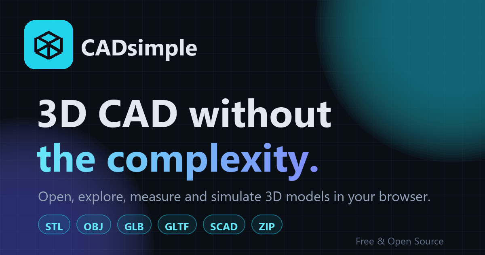

# CADsimple

**3D CAD without the complexity.**

[](https://berkkarabacak.github.io/cadsimple/)
[](LICENSE)
[](https://berkkarabacak.github.io/cadsimple/)



Open, explore, measure and simulate 3D models directly in your browser.
No installation. No account. No CAD experience required.

CADsimple is built for everyone who finds traditional CAD software overwhelming.
Visit the site, drop a file, and you're already using it — the whole interface is four verbs:
**Open → Explore → Measure → Simulate.**

## Features

- **Instant import** — drag & drop `.STL`, `.OBJ`, `.GLB`, `.GLTF`, `.SCAD` or `.ZIP`.
  ZIP archives are unpacked automatically; multi-model archives are laid out side by side.
- **Private by design** — all processing happens locally in your browser; files are never uploaded.
- **Effortless navigation** — drag to rotate, scroll to zoom, right-drag to pan,
  one-click front / back / left / right / top / bottom / 3D views, perspective & orthographic.
- **Object inspection** — click to select, then move, rotate, hide, isolate or fade parts.
- **Simple measurement** — click two points, get a distance in mm / cm / m / inches.
- **Movement simulation** — pick a pivot point, set limits, drag a slider and watch doors,
  hinges and folding parts move, with basic collision highlighting.
- **Parametric OpenSCAD** — top-level variables automatically become friendly
  steppers; edit `fold_angle`, `width`, `height` and watch the model rebuild live.
  Source stays available under *Advanced*.

## OpenSCAD support

CADsimple ships a browser-side OpenSCAD-subset interpreter (no server, no install):

- `cube`, `sphere`, `cylinder` primitives
- `translate` / `rotate` / `scale` / `mirror` transforms
- `module` definitions & calls with parameters and lexical scope
- `for` loops over ranges (`[0:10:90]`) and lists, `if` / `else`
- `color([r, g, b])`, vector indexing (`size[0]`), arithmetic expressions
- `minkowski()` of cube + sphere renders as a proper rounded box
- boolean blocks (`union` / `difference` / `intersection`) render as overlays

Full OpenSCAD compilation via WASM can replace the interpreter behind the same
`compileScad(source)` interface without touching the UI.

## Tech stack

- **React 19 + TypeScript + Vite**
- **Three.js + React Three Fiber + drei** for rendering
- **Tailwind CSS + shadcn/ui** for the interface
- **JSZip** for archive unpacking
- **Zustand** for state

## Getting started

```bash
git clone https://github.com/berkkarabacak/cadsimple.git
cd cadsimple
npm install
npm run dev      # http://localhost:7100
```

Other scripts:

```bash
npm run build    # production build → dist/
npm run preview  # serve the production build locally
npm run lint     # eslint
```

## Deployment

The production build is a plain static site. This repo deploys to GitHub Pages
from the `gh-pages` branch:

```bash
npm run build
# publish dist/ to the gh-pages branch root (any tool works — e.g. git worktree)
```

It also works out of the box on Vercel, Netlify, Cloudflare Pages or any static host.

## Architecture

```
src/
├─ pages/            Landing + Workspace (route-level)
├─ components/
│  ├─ landing/       Hero 3D demo
│  └─ viewer/        Viewport, Toolbar, panels (scene / properties / measure / simulate / params)
└─ lib/
   ├─ store.ts       Zustand state: parts, selection, tools, measurement, simulation
   ├─ importers.ts   Format dispatch: STL / OBJ / GLTF / ZIP  (add new formats here)
   ├─ scad.ts        Browser-side OpenSCAD-subset interpreter + parameter extraction
   ├─ geom.ts        Bounding boxes, view fitting, unit helpers
   └─ samples.ts     Built-in demo models
```

The layers are deliberately separated:
**UI → 3D viewer → file importers → model representation → simulation tools.**
Adding a new format means adding one importer function in `src/lib/importers.ts` —
no UI changes required.

### Roadmap

- [ ] STEP / STP and IGES import (via a browser WASM kernel)
- [ ] Full OpenSCAD compilation via WASM (true boolean ops)
- [ ] Export measurements / screenshots
- [ ] Shared links for models

## Contributing

Contributions are very welcome — see [CONTRIBUTING.md](CONTRIBUTING.md).
Good first issues: new import formats, more SCAD primitives, touch-gesture polish.

## License

[MIT](LICENSE) — use it, fork it, ship it.
